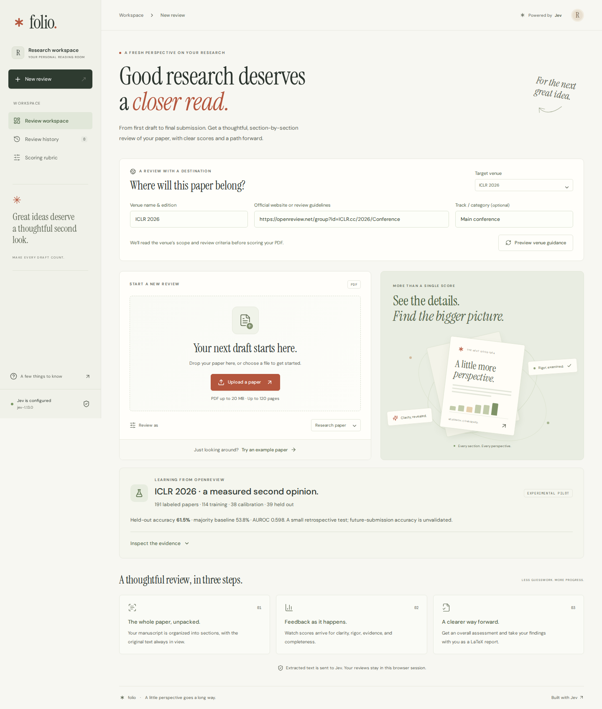

# Folio

A thoughtful paper reviewer built with **Jev**, FastAPI, and React. Upload a PDF and see section scores appear as they are evaluated. Every upload—including the same filename—starts a new review. Replacing an upload cancels pending requests and prevents old results from changing the new review.



## Run locally

Requires Python 3.11+, [uv](https://docs.astral.sh/uv/), and Node.js 20.19+.

```bash
uv sync
npm ci
npm run dev
```

Open **http://127.0.0.1:5173**. The API runs on port 8000.

Put your key in the root `.env` file. An existing `.env` is never overwritten; `.env.example` documents the available settings.

```dotenv
JEV_API_KEY=your_typesafe_key
JEV_MODEL=jev-1.13.0
JEV_CONCURRENCY=3
```

`TYPESAFE_API_KEY` is also accepted. Credentials are only used on the server, never sent to the browser or embedded in the build. Restart the API after changing `.env`.

For the compiled application on a single origin:

```bash
npm run build
npm start
```

Open **http://127.0.0.1:8000**. The included commands bind to loopback and are intended for a personal research workspace. A public deployment needs authentication, per-user quotas, upload/request limits at the reverse proxy, and appropriate data handling controls.

## What it does

- Drag-and-drop upload, a file picker, and an original synthetic example PDF.
- Layout-aware section extraction with page references and an inspectable manuscript view.
- Separate research, survey, and theory profiles.
- Four core Jev Score questions per passage: clarity, rigor, evidence, and completeness; a fifth measures venue fit when a venue is selected.
- A target conference or journal, official website, and optional track; published website passages ground each section's assessment.
- Live NDJSON results, provisional totals, final recommendation, and visible confidence distributions.
- Fresh reviews on every upload, including identical files; request cancellation and stale-result guards.
- Session-only history for up to 20 completed reviews.
- Downloadable LaTeX and JSON reports with provenance, section weights, and limitations.
- Responsive layouts, keyboard interaction, reduced-motion support, and accessible color contrast.

## Ground a review in a venue

**ICLR 2026** is selected by default, using its [OpenReview venue group](https://openreview.net/group?id=ICLR.cc/2026/Conference) and official [reviewer guide](https://iclr.cc/Conferences/2026/ReviewerGuide). The NeurIPS preset remains available. OpenReview group URLs resolve through public group metadata to the venue website; the ICLR preset selects its scientific reviewer guide. Change **Target venue** to **Custom conference or journal** to enter another venue's name, edition, official website or guidelines URL, and optional track. General research reviews remain available. Your chosen venue stays selected when you start another review in the same session.

**Preview venue guidance** shows the selected website passages and their source links before uploading. Each upload independently retrieves current guidance, then supplies those passages to Jev for every section and criterion. **Venue fit** contributes 20% of the score; the four core dimensions contribute 80%. These are Folio's weights, not the venue's official scoring scale or acceptance odds. On a completed review, **Change target venue → Review for this venue** assesses the same PDF again. History retains the venue and sources actually used for each saved review.

The source panel records URLs, retrieval times, page hashes, and the selected passages. JSON exports retain the complete selected context; LaTeX exports include source provenance and a short excerpt. The reader accepts public HTTPS HTML pages, follows up to two relevant links on the same site, and prioritizes headings and the requested track. Prefer a direct review-guidelines, call-for-papers, or aims-and-scope page. Login-protected pages, JavaScript-only content, and PDF guidelines are unsupported. If no usable guidance is retrieved, the venue review stops with an actionable error. Selected excerpts do not establish exhaustive policy compliance or verify that a user-supplied site is official.

## Scoring

Jev is a structured decision model, not a generative reviewer. It evaluates five descriptive levels (0–4), and the application normalizes its scores to 0–100. Readable findings are **rubric-derived templates**, and source excerpts are provided as context rather than asserted model rationales.

The section score is `0.20 × clarity + 0.35 × rigor + 0.30 × evidence + 0.15 × completeness`. Overall section weights are grouped by role; a role's weight is divided among its sections by word count. Multiple subsections therefore do not receive extra influence merely because they are split apart. The complete rubric and thresholds are available in the interface and in `server/rubric.py`.

With venue grounding, the section score is `0.16 × clarity + 0.28 × rigor + 0.24 × evidence + 0.12 × completeness + 0.20 × venue fit`. The website context informs all five judgments. The role aggregation, provisional scoring, confidence check, and recommendation thresholds remain the same. The current rubric version is `folio-2.0`. Earlier general and NeurIPS integration studies used `folio-1.0` and `folio-1.1`, respectively.

| Manuscript rubric score | Rubric recommendation |
| ----------------------- | --------------------- |
| 85–100                  | Strong accept         |
| 70–<85                  | Accept                |
| 55–<70                  | Weak accept           |
| 45–<55                  | Weak reject           |
| 25–<45                  | Reject                |
| <25                     | Strong reject         |

These rubric labels describe an application score. The separately trained ICLR acceptance estimate uses the probability bands below. Mean Jev confidence below 45% flags the assessment for expert review without inventing a seventh outcome. Incomplete or failed reviews receive no final recommendation or acceptance estimate. Jev confidence describes concentration of its output distribution, not acceptance probability or scientific correctness.

Limits: 20 MB, 120 pages, 400,000 extracted characters, and 64 review units. Long sections are evaluated in non-overlapping passages of at most 9,000 UTF-8 bytes; all non-status passage text is evaluated. Explicit publication-status and anonymous-author lines are removed from model inputs. An explicitly bounded abstract and scientific outline provide context; OpenReview manuscript titles are withheld, and acknowledgement headings are excluded from that outline. Passage scores are weighted by character count.

Scanned PDFs require OCR before upload. The text pipeline does not verify references, novelty, figure content, numerical results, or mathematical proofs. Headings and column order remain heuristic. Inspect the extracted manuscript for unusual layouts. Portable LaTeX exports transliterate non-ASCII text; the JSON export preserves exact Unicode.

## ICLR 2026 acceptance pilot

**A real supervised classifier is trained on Jev's numerical outputs. Jev itself is not fine-tuned.** The authorized 200-PDF pilot produced 191 usable papers: 114 training, 38 calibration, and 39 held-out test papers. The dataset contains 89 accepted and 102 rejected manuscripts. The classifier uses the mean and spread of five Jev criteria across scientific sections, for ten features. Reviewer scores, human reviews, decisions, identifiers, filenames, and publication-status metadata are excluded from prediction features.

A standardized logistic regression is selected by five-fold cross-validation on the training split only, followed by sigmoid calibration on the separate calibration split. The test split is untouched by model selection. The trained parameters ship as inspectable JSON in [artifacts/iclr2026-model.json](artifacts/iclr2026-model.json).

| Held-out metric               | Jev classifier | Training-prevalence baseline |
| ----------------------------- | -------------: | ---------------------------: |
| Accuracy                      |          61.5% |                        53.8% |
| Balanced accuracy             |          59.5% |                        50.0% |
| AUROC                         |          0.598 |                        0.500 |
| Brier error (lower is better) |          0.240 |                        0.249 |

**Predictive evidence is weak.** The AUROC 95% bootstrap interval is 0.405–0.778 and includes chance ranking. At a 0.50 threshold, the classifier misses 12 of the 18 accepted test papers. The point estimates do not establish reliable superiority or future-submission accuracy.

The final view returns a binary Accept/Reject prediction and one of six outcomes:

| Estimated acceptance probability | Outcome       |
| -------------------------------- | ------------- |
| 0–<15%                           | Strong reject |
| 15–<30%                          | Reject        |
| 30–<50%                          | Weak reject   |
| 50–<70%                          | Weak accept   |
| 70–<85%                          | Accept        |
| 85–100%                          | Strong accept |

These are display bands, not six observed ground-truth classes or an official ICLR scale. In this pilot, all held-out estimates fall between 31.2% and 61.7%; the four stronger bands were not reached. A known training paper is visibly identified as non-independent. Changing the venue, profile, Jev version, rubric, or selected guidance invalidates this model's acceptance estimate; section reviews remain available. The other venues require their own labeled studies before empirical acceptance prediction is available.

### Where the ground truth came from

Direct OpenReview note and PDF requests returned HTTP 403 challenges. We downloaded original OpenReview PDFs from the public [weathon/iclr_2026 mirror](https://huggingface.co/datasets/weathon/iclr_2026/tree/7a02654128d0ecb559ae5ef9b670dcaa564ad199), then required final decisions to agree with a separately pinned [Paper Copilot snapshot](https://github.com/papercopilot/paperlists/tree/875df9d6550849ec07c9c6feba24986be2dd4551). These are corroborating archives; authoritative decision notes were not directly re-fetched in this environment. Each PDF is checked against its pinned SHA-256. Withdrawals, desk rejections, conditional outcomes, disputes, and missing labels are excluded.

Of 393 mirrored PDFs, 313 met the metadata and size criteria. A stratified sample of 200 yielded 191 after nine extraction failures. **88 of 89 accepted PDFs contain a publication header.** Explicit headers are stripped before scoring, but post-acceptance revision content can still leak outcome information. This is a selected, retrospective archive, not a representative sample of submission-time manuscripts. Unknown Jev pretraining overlap is another limitation. Final decisions are organizational outcomes, not scientific truth or section-quality labels.

The welcome screen exposes the counts, baseline, and source revisions. Its evidence browser filters accepted, rejected, and held-out papers and links to the OpenReview forum and downloadable mirrored PDF. Download the complete [study manifest and predictions](reports/iclr2026-study.json), [numeric features](reports/iclr2026-features.json), or read the [LaTeX findings](reports/iclr2026-findings.tex) / [compiled PDF](reports/iclr2026-findings.pdf).

### Reproduce training

```bash
# Downloads at most 200 PDFs, verifies labels/hashes, and freezes the splits.
uv run python scripts/train_openreview.py --stage prepare --limit 200
# Uses the configured Jev key; completed papers are cached for resumability.
uv run python scripts/train_openreview.py --stage score
# Fits and evaluates from cached scores; does not call Jev.
uv run python scripts/train_openreview.py --stage fit
uv run --with matplotlib python scripts/plot_openreview.py
npm run report:iclr
```

The initial run evaluated 3,782 sections in 4,370 passage requests, with 18,037,875 input tokens and 327,750 output tokens. Raw PDFs, parsed text, pinned source snapshots, and detailed scores live under the ignored `data/openreview/iclr2026/` directory. Keep that directory to refit without paying for scoring again. `--data-dir` can isolate a new study; incompatible cached model/rubric/guidance versions are rejected. Optional `FOLIO_ACCEPTANCE_MODEL` selects another compatible JSON artifact.

Two further live uploads of one already-scored held-out paper completed in 2.16 and 1.83 seconds, produced fresh review IDs/source timestamps, and returned Weak reject estimates of 42.3% and 42.5%. These are integration observations, not additional independent accuracy samples. See [live measurements](reports/iclr2026-live-validation.json).

## Data handling

The server sends extracted text to `https://api.typesafe.ai/v1/systemone`. Ordinary web uploads do not persist manuscripts or completed reports on the server. The explicitly run research CLI persists its downloaded corpus and scores locally. Framework upload buffering can create temporary files, which are closed after reading. Browser memory retains completed reviews and their files until reload, with a maximum history of 20. No localStorage or third-party analytics is used; fonts are bundled locally. TypeSafe's handling of API data is governed by its own [policies](https://docs.typesafe.ai/legal).

For venue reviews, the server also reads the supplied website and sends selected public passages to Jev. Website requests include no manuscript, API credential, or browser cookies. Connections are pinned to validated public IP addresses, with same-site redirect checks, a 2 MB page limit, and a 35-second retrieval deadline. No venue-response cache is used.

The checked-in example and study artifacts were deliberately generated by the benchmark script; ordinary uploads do not create these artifacts. The configured secret `.env` is ignored by Git.

## Engineering validation and earlier integration studies

- **114 backend tests**: PDF parsing, scoring, cancellation, exports, plus venue-source retrieval, public-address restrictions, track selection, source provenance, five-question Jev requests, venue weighting, retrieval failures, and fresh sources on repeated uploads.
- **30 browser tests** across desktop and mobile: real-time streams, uploads, stale responses, exports, history, rubric inspection, venue selection, source previews, venue changes, retrieval errors, and automated accessibility checks.
- **Nine earlier live API reviews (`folio-1.0`)**: three repetitions each for a structured synthetic manuscript, a deliberately vague variant, and _On Calibration of Modern Neural Networks_ (Guo et al., 2017).
- **Two earlier live venue reviews (`folio-1.1`)**: repeated uploads of the structured synthetic manuscript using NeurIPS 2026 guidance. Both completed all eight sections with five criteria, scoring 77.4/100; venue-fit scores were 65.2 and 65.9. Total latencies including website retrieval were 1.49 s and 1.14 s. These are integration observations, not scientific-validity measurements.

In those earlier general-review experiments, the measured mean full-review latencies were 0.71 s, 0.66 s, and 1.24 s respectively. Corresponding scores were 80.7, 20.5, and 68.8. **The synthetic manuscript outscored the published paper; these numbers are not a validated ranking of scientific merit.** This small study establishes integration behavior, response times in this environment, and sensitivity to a controlled writing change. It does not establish peer-review accuracy or human agreement.

See [the LaTeX findings](reports/findings.tex), [compiled report](reports/findings.pdf), and [raw measurements](reports/benchmark-results.json). An actual [example review](reports/example-review.tex) and its [compiled PDF](reports/example-review.pdf) are also included.

The venue extension has separate [live measurements](reports/venue-validation.json) and a [LaTeX example](reports/venue-example-review.tex) with its [compiled PDF](reports/venue-example-review.pdf).

```bash
npm test
npx playwright install chromium
npm run test:e2e
npm run build
uv run ruff check server tests scripts
```

The automated tests mock Jev and do not spend API credits. To repeat the live study (requires the running server and uses the configured API key):

```bash
uv run python scripts/benchmark.py --public --repeats 3
uv run python scripts/benchmark_venue.py
uv run --with matplotlib python scripts/plot_findings.py
npm run report
```

`npm run report` requires a LaTeX installation with `latexmk` and `pdflatex`. The findings narrative records the delivered study; if new measurements differ, update that narrative as well as regenerating its tables and figures.

## Project map

```text
src/                    React interface, stream consumer, browser exports
server/pdf.py           PDF extraction and passage splitting
server/jev.py           Authenticated Jev requests, validation, retries
server/rubric.py        Questions, section weighting, recommendation policy
server/venue.py         Venue guidance retrieval, passage selection, provenance
server/app.py           Upload, stream, health, rubric, and export endpoints
server/export.py        Escaped, portable LaTeX report generation
server/prediction.py    Calibrated acceptance inference and compatibility checks
artifacts/              Trained, inspectable ICLR 2026 model parameters
tests/                  Backend tests and desktop/mobile browser scenarios
scripts/                OpenReview download/training, studies, and figure generation
reports/                Findings, measurements, example review, screenshots
```

Implementation follows the official [Jev introduction](https://docs.typesafe.ai/introduction), [Score primitive](https://docs.typesafe.ai/primitives/score), [HTTP API](https://docs.typesafe.ai/api), and [model documentation](https://docs.typesafe.ai/models).
